#   CS336复习笔记 1


## Introduction

实验都做了什么？

- 参考原文档，可以得知，共有四个部分
- 
- 依次为
  - 实现一个BPETokenizer，可以将文本中出现频率最高byte-pair合并为一个byte，并且根据这种合并关系得到一个byte向id映射的表，最终根据这个表对文本进行编码和解码
  - 利用基本的torch库函数，实现一个最简版本的transformer，其中每个模块都需要自己实现
  - 训练模型所需要的工具
  - 实现训练循环和保存、加载模型的工具
- 主要的开发难度集中在前两个部分中


## BPE Tokenizer的实现（1）- Train BPE部分

### 原理

BPE是一种介于char-level和word-level的编码方式

- 首先从char-level来看，每个字符用一个编码，自然可以表示正常情况下的所有文本，但是这种方法会大量占用空间，同时其实没有起到什么实际意义上的作用，只不过是把字符逐个转写成了数字

- 其次看word-level编码，每个单词应用一个编码，固然可以节约空间，但是针对训练过程中没有出现过的单词将无法编码

因此寻找一个折中点，建立在对所有字符编码的基础上，将最常出现的字符合并为一个“字符”（这里事实上是通过bytes数据类型实现的，合并为了一个二进制字符串），并保存合并顺序以方便编码。

在实际实现过程中，需要注意使用正则表达式来将特殊标识从文本中分离出去，以及由于文本往往很大，因此不能每次都从头到尾扫一遍来更新，所以需要保存过程中的统计信息来不断重复寻找最高频字符对。主要维护两个映射关系**{token:[frequency,split[]}和{byte_pair:[frequency,tokens[]]}**

除此之外，原文档给出了将文本预分词为tokens的正则表达式，在正式进行 BPE 合并前，先对文本进行初步的分词或边界划分，确保 BPE 不会跨越语义或结构上不应合并的边界（如空格、标点、中文词、代码符号等）。

### 思考

- 如果提问到的话，这里的实现思路应该是重点，但是细节应该不重要，个人感觉太基础了

- 应该不至于手撕

### 实现

初始化词库并进行预处理，首先将256个字符转为bytes并导入vocab，将special_tokens进行encode并导入vocab

```python
    # 初始化vocab
    # 256个单字节 + special tokens
    # 注意是bytes([i])，传入一个可迭代对象，否则会产生i个0
    vocab: dict[int, bytes] = {i: bytes([i]) for i in range(256)}
    # 导入特殊符号
    special_tokens_vocab = {256 + i: token.encode("utf-8") for i, token in enumerate(special_tokens)}
    # 合并
    vocab.update(special_tokens_vocab)
```

编译pre_tokenize和查找special_tokens的正则表达式，实测这一部分其实不是很耗时，但是严格来看的话最好在初始化过程中编译

```python
    # 编译pre_token过程中要使用的正则表达式
    pre_token_re = re.compile(PAT)

    # 编译分离特殊符号的正则表达式
    special_pat = "|".join(re.escape(t) for t in special_tokens)  # 注意转义，最终是形如 a|b|c 的形式
    special_re = re.compile(special_pat) if special_pat != "" else None
```

准备保存以下数据

- 每一个token的频数和划分方式，token_dict
  - 保存频数是一个省空间的trick，当然事实上其实没有省很多
- bytes对的频数以及位于哪些token中，pair_dict，用于在merge过程中查询并进行更新
- merges
  - 按顺序保留每次选中的bytes-pair

```python
    pair_dict = PairDict()
    token_dict = TokenDict()
    merges: list[tuple[bytes, bytes]] = []
```

为了方便过程中调用，为dict实现了一些方法，主要是包装一些访问方法以及错误处理

```python
class TokenDict:
    def __init__(self):
        # 记录当前所有token的频次，注意token是bytes类型
        self.token2count = {}
        # 记录每个token当前的划分模型，初始时都是单个字符
        self.token2splits: dict[bytes, list[bytes]] = {}

class PairDict:
    def __init__(self):
        self.pair2count = {}
        self.pair2tokens: dict[tuple[bytes, bytes], set[bytes]] = {}

    def add_pair(self, pair: tuple[bytes, bytes], count: int, token: bytes):
        try:
            self.pair2count[pair] += count
            self.pair2tokens[pair].add(token)
        except KeyError:
            self.pair2count[pair] = count
            self.pair2tokens[pair] = {token}

    def discard_pair(self, pair: tuple[bytes, bytes], count: int, token: bytes):
        try:
            self.pair2count[pair] -= count
            self.pair2tokens[pair].discard(token)
        except KeyError:
            # 抛给上层处理
            raise KeyError

    def __getitem__(self, pair: tuple[bytes, bytes]) -> tuple[int, set[bytes]]:
        return self.pair2count[pair], self.pair2tokens[pair]

    def get_max_pair(self) -> tuple[bytes, bytes]:
        max_freq = max(freq for freq in self.pair2count.values())
        max_pairs = [pair for pair, freq in self.pair2count.items() if freq == max_freq]
        # 返回其中字典序最大的pair
        return max(max_pairs)
```

首先使用find_chunk_boundaries对文本进行预处理，将文本划分为数个chunk，注意需要将chunk解码为str才能应用正则表达

```py
    # 初始化token_dict和pair_dict
    with open(input_path, "rb") as f:
        num_chunks = os.cpu_count()
        boundaries = find_chunk_boundaries(f, num_chunks, b"<|endoftext|>")
```

分别处理每个chunk，首先读取全部文本进行dict的初始化过程，之后就不需要再扫描文本文件，可以提升效率

- 注意要对chunk中的换行符进行替换处理`chunk = re.sub(r"\r\n?", "\n", chunk)`
- 
- 使用special_tokens的正则表达式将chunk划分为数个part，形成一个parts列表，如果没有特别token，就只有一个part
- 对于每个part
  - 使用pre_tokenize正则表达式将part划分为数个pre_token，使用迭代器每次读入一个token进行处理
  - 对于每个pre_token
    - 首先编码为bytes
    - 在pre_token_dict中更新值域：pre_token_dict[][0] = 频数, pre_token_dict[][1] = 划分方式，也就是按照bytes划分的列表
    - 遍历bytes划分方式，更新pair_dict中每个bytes对的值域：pair_dict[][0] = 频数, pair_dict[][1] = 出现该bytes对的token列表
    - 注意这里有个小区别：pre_token_dict中存储的是bytes列表，而pair_dict中存储的是一个set,保存该pair所在的token，用于在后续合并时更新计数
    - 注意通过trycatch捕获键错误

```py
        for start, end in zip(boundaries[:-1], boundaries[1:]):
            f.seek(start)
            # 注意此时chunk由bytes类型转换为str类型，可以应用正则表达式
            chunk = f.read(end - start).decode("utf-8", errors="ignore")
            # 接下来使用正则表达式进行一些处理
            # 首先，需要调整换行符号，原因在报错中可以发现
            chunk = re.sub(r"\r\n?", "\n", chunk)
            # 其次，去除其中的特殊符号，根据特殊符号进行分段
            if special_re is not None:
                segments = special_re.split(chunk)
            else:
                segments = [chunk]
            # 最后，对每一个segment进行预分词
            for seg in segments:
                if not seg:
                    continue
                for token_str_match in pre_token_re.finditer(seg):
                    token_str = token_str_match.group(0)
                    token_by = token_str.encode("utf-8")  # 转为bytes类型

                    # 更新token_dict，将token_by加入token_dict，频次计数加一，划分模式为单个字符
                    try:
                        token_dict.token2count[token_by] += 1
                    except KeyError:
                        token_split = [bytes([b]) for b in token_by]
                        token_dict.token2count[token_by] = 1
                        token_dict.token2splits[token_by] = token_split

                    # 更新pair_dict，统计token_by中相邻字符对的频次
                    token_split = token_dict.token2splits[token_by]
                    for adj_pair in zip(token_split[:-1], token_split[1:]):
                        pair_dict.add_pair(adj_pair, 1, token_by)
```

完成初始化统计后，开始尝试合并，统计len(vocab)直到大小达到指定数量

```py
    while len(vocab) < vocab_size:
```

开始循环merge

- 寻找最大频率的bytes对

- 找到这些bytes对中字典序最大的bytes对，将该bytes对添加到merges列表中

- 将该bytes对合并为一个新的token，加入vocab

- 根据pair_dict所存储的token列表，找到该bytes对所在的tokens，进行更新，注意这里的数据类型是set，需要转为list进行遍历

  - 在token_dict中找到每一个token，得到其频数tok_freq以及划分方式
  - 统计旧划分方式的相邻bytes对，根据merge的bytes对，统计新划分方法下的相邻bytes对

  - 更新pre_token_dict中该token的划分方式
  - 统计两种划分方式下的bytes对，进行计数，在pair_dict中进行更新
    - pair_dict的频数部分减去旧划分方式下的count * tok_freq，并在set部分中删除该token
    - pair_dict的频数部分加上新划分方式下的count * tok_freq，并在set部分中添加该token
    - 注意通过trycatch捕获键错误

```py
        max_pair = pair_dict.get_max_pair()
        merged_pair = max_pair[0] + max_pair[1]
        merges.append(max_pair)
        vocab[len(vocab)] = merged_pair
        # 对所有包含该pair的token进行更新
        # 首先根据pair_dict找到包含该pair的token
        # 注意这里使用pop而不是直接访问，是因为后续不再需要访问该pair了
        # 但是由于key同时会被pop，因此后续访问时可能会出现KeyError
        tokens_to_update = pair_dict.pair2tokens.pop(max_pair)
        # 最后，统计每个token中该pair的出现次数，注意根据划分模式进行统计
        for token in tokens_to_update:
            token_freq = token_dict.token2count[token]
            old_split = token_dict.token2splits[token]
            new_split = get_new_split(old_split,max_pair, merged_pair)
            # 统计旧划分模式中该pair的出现次数
            old_adj_pairs = list(zip(old_split[:-1], old_split[1:]))
            new_adj_pairs = list(zip(new_split[:-1], new_split[1:]))
            # 更新token_dict中的划分方式
            token_dict.token2splits[token] = new_split

            old_cnt = Counter(old_adj_pairs)
            new_cnt = Counter(new_adj_pairs)

            # 更新计数
            for pair, count in old_cnt.items():
                # count是pair在该token中出现的次数，token_freq是该token在语料库中出现的次数
                # 二者的乘积就是该pair在语料库中出现的次数
                # 更新非合并对的频数和位置
                try:
                    # 这里可能会出现KeyError，因为某些pair可能已经被合并掉了
                    pair_dict.discard_pair(pair, count * token_freq, token)
                except KeyError:
                    # 已经作为max_pair被合并掉了
                    # pair2tokens会有KeyError
                    continue

            for pair, count in new_cnt.items():
                # 与上述类似

                pair_dict.add_pair(pair, count * token_freq, token)
```

### 完整代码

```python

def find_chunk_boundaries(
        file: BinaryIO,
        desired_num_chunks: int,
        split_special_token: bytes,
) -> list[int]:
    """
    Chunk the file into parts that can be counted independently.
    May return fewer chunks if the boundaries end up overlapping.
    """
    assert isinstance(split_special_token, bytes), "Must represent special token as a bytestring"

    # Get total file size in bytes
    file.seek(0, os.SEEK_END)
    file_size = file.tell()
    file.seek(0)

    chunk_size = file_size // desired_num_chunks

    # Initial guesses for chunk boundary locations, uniformly spaced
    # Chunks start on previous index, don't include last index
    chunk_boundaries = [i * chunk_size for i in range(desired_num_chunks + 1)]
    chunk_boundaries[-1] = file_size

    mini_chunk_size = 4096  # Read ahead by 4k bytes at a time

    for bi in range(1, len(chunk_boundaries) - 1):
        initial_position = chunk_boundaries[bi]
        file.seek(initial_position)  # Start at boundary guess
        while True:
            mini_chunk = file.read(mini_chunk_size)  # Read a mini chunk

            # If EOF, this boundary should be at the end of the file
            if mini_chunk == b"":
                chunk_boundaries[bi] = file_size
                break

            # Find the special token in the mini chunk
            found_at = mini_chunk.find(split_special_token)
            if found_at != -1:
                chunk_boundaries[bi] = initial_position + found_at
                break
            initial_position += mini_chunk_size

    # Make sure all boundaries are unique, but might be fewer than desired_num_chunks
    return sorted(set(chunk_boundaries))


def get_new_split(old_split: list[bytes], pair: tuple[bytes, bytes], merged: bytes) -> list[bytes]:
    new_split = []
    i = 0
    while i < len(old_split):
        if i < len(old_split) - 1 and (old_split[i], old_split[i + 1]) == pair:
            new_split.append(merged)
            i += 2
        else:
            new_split.append(old_split[i])
            i += 1
    return new_split
def get_bpe_train(
        input_path: str | os.PathLike,
        vocab_size: int,
        special_tokens: list[str],
        **kwargs,
) -> tuple[dict[int, bytes], list[tuple[bytes, bytes]]]:
    PAT = r"""'(?:[sdmt]|ll|ve|re)| ?\p{L}+| ?\p{N}+| ?[^\s\p{L}\p{N}]+|\s+(?!\S)|\s+"""

    # 初始化vocab
    # 256个单字节 + special tokens
    # 注意是bytes([i])，传入一个可迭代对象，否则会产生i个0
    vocab: dict[int, bytes] = {i: bytes([i]) for i in range(256)}
    # 导入特殊符号
    special_tokens_vocab = {256 + i: token.encode("utf-8") for i, token in enumerate(special_tokens)}
    # 合并
    vocab.update(special_tokens_vocab)

    # 编译pre_token过程中要使用的正则表达式
    pre_token_re = re.compile(PAT)

    # 编译分离特殊符号的正则表达式
    special_pat = "|".join(re.escape(t) for t in special_tokens)  # 注意转义，最终是形如 a|b|c 的形式
    special_re = re.compile(special_pat) if special_pat != "" else None

    pair_dict = PairDict()
    token_dict = TokenDict()
    merges: list[tuple[bytes, bytes]] = []

    # 初始化token_dict和pair_dict
    with open(input_path, "rb") as f:
        num_chunks = os.cpu_count()
        boundaries = find_chunk_boundaries(f, num_chunks, b"<|endoftext|>")
        for start, end in zip(boundaries[:-1], boundaries[1:]):
            f.seek(start)
            # 注意此时chunk由bytes类型转换为str类型，可以应用正则表达式
            chunk = f.read(end - start).decode("utf-8", errors="ignore")
            # 接下来使用正则表达式进行一些处理
            # 首先，需要调整换行符号，原因在报错中可以发现
            chunk = re.sub(r"\r\n?", "\n", chunk)
            # 其次，去除其中的特殊符号，根据特殊符号进行分段
            if special_re is not None:
                segments = special_re.split(chunk)
            else:
                segments = [chunk]
            # 最后，对每一个segment进行预分词
            for seg in segments:
                if not seg:
                    continue
                for token_str_match in pre_token_re.finditer(seg):
                    token_str = token_str_match.group(0)
                    token_by = token_str.encode("utf-8")  # 转为bytes类型

                    # 更新token_dict，将token_by加入token_dict，频次计数加一，划分模式为单个字符
                    try:
                        token_dict.token2count[token_by] += 1
                    except KeyError:
                        token_split = [bytes([b]) for b in token_by]
                        token_dict.token2count[token_by] = 1
                        token_dict.token2splits[token_by] = token_split

                    # 更新pair_dict，统计token_by中相邻字符对的频次
                    token_split = token_dict.token2splits[token_by]
                    for adj_pair in zip(token_split[:-1], token_split[1:]):
                        pair_dict.add_pair(adj_pair, 1, token_by)

    while len(vocab) < vocab_size:
        max_pair = pair_dict.get_max_pair()
        merged_pair = max_pair[0] + max_pair[1]
        merges.append(max_pair)
        vocab[len(vocab)] = merged_pair
        # 对所有包含该pair的token进行更新
        # 首先根据pair_dict找到包含该pair的token
        # 注意这里使用pop而不是直接访问，是因为后续不再需要访问该pair了
        # 但是由于key同时会被pop，因此后续访问时可能会出现KeyError
        tokens_to_update = pair_dict.pair2tokens.pop(max_pair)
        # 最后，统计每个token中该pair的出现次数，注意根据划分模式进行统计
        for token in tokens_to_update:
            token_freq = token_dict.token2count[token]
            old_split = token_dict.token2splits[token]
            new_split = get_new_split(old_split,max_pair, merged_pair)
            # 统计旧划分模式中该pair的出现次数
            old_adj_pairs = list(zip(old_split[:-1], old_split[1:]))
            new_adj_pairs = list(zip(new_split[:-1], new_split[1:]))
            # 更新token_dict中的划分方式
            token_dict.token2splits[token] = new_split

            old_cnt = Counter(old_adj_pairs)
            new_cnt = Counter(new_adj_pairs)

            # 更新计数
            for pair, count in old_cnt.items():
                # count是pair在该token中出现的次数，token_freq是该token在语料库中出现的次数
                # 二者的乘积就是该pair在语料库中出现的次数
                # 更新非合并对的频数和位置
                try:
                    # 这里可能会出现KeyError，因为某些pair可能已经被合并掉了
                    pair_dict.discard_pair(pair, count * token_freq, token)
                except KeyError:
                    # 已经作为max_pair被合并掉了
                    # pair2tokens会有KeyError
                    continue

            for pair, count in new_cnt.items():
                # 与上述类似

                pair_dict.add_pair(pair, count * token_freq, token)

    return vocab, merges
```

## BPE Tokenizer的实现（2）- Encode-Decode部分

### 原理

实现一个对象tokenizer对象，能够从文件读入json格式的vocab和txt格式的merges列表

读入过程很简单，关键在于读入后需要初始化一些构造，例如id到bytes和bytes到id的映射，vocab中所有bytes的集合方便速查，merges中的bytes-pair到顺序的映射方便快速查找合并对象

具体实现过程中

- decode很简单，输入一个id序列，根据id到bytes映射依次翻译过去即可
- encode的逻辑主要在于选择合适的id，事实上每一个token都可能具有多种划分方法，一个最简单的例子是，假如vocab中存在“ab”和"bc"，那么对于token："abc"，到底是应该划分为"a | bc"还是"ab | c"，这里影响选择的就是这两组bytes-pair在merges列表中的相对顺序，根据原文档的描述，靠前的bytes-pair应该被优先选中。在实现时，需要维护一个循环来划分token，初始为单字母划分，每次从现在的划分方法中找到一个序号最小的候选pair，之后使用该pair更新划分方法，直到该token中找不到新的pair为止

### 思考

与上述相似，主要在于运行过程能描述清楚

### 实现

需要额外描述的东西不多，只有极个别要点

- 可以将encode中最前面那一些正则表达式转移到初始化过程中，能提升一点性能
- 不管有没有特殊符号，都要进行分词，如果不分词就是对整个text进行encode过程，虽然最终结果也是对的，但是每次都要遍历全部文本进行划分的查找与更新，非常浪费性能，实测运行时长能达到预分词的二到三倍
- iterable方法需要使用yield关键字，用于每次调用的时候自动向下迭代一次，一般是迭代器会使用的
- decode过程对无法识别的id使用replace模式，这个是原文档中要求的，但是不清楚测试中是否有包含在内？

### 完整代码

```python
class BPETokenizer:
    def __init__(
            self,
            vocab: dict[int, bytes] = None,
            merges: list[tuple[bytes, bytes]] = None,
            special_tokens: list[str] | None = None):
        self.vocab = vocab
        self.merges = merges
        self.special_tokens = special_tokens
        self.bytes2idx = {v: k for k, v in vocab.items()} if vocab is not None else {}
        self.bytes_set = set(self.bytes2idx.keys())
        self.mergepair2idx = {pair: i for i, pair in enumerate(merges)} if merges is not None else {}
        self.max_token_length = max(len(v) for v in self.bytes2idx.keys()) if vocab is not None else 0


    @classmethod
    def from_files(cls, vocab_filepath: str, merges_filepath: str, special_tokens: list[str] | None = None):
        # 观察fixtures中的文件可以发现，vocab文件保存为json，merges文件保存为txt，每一行是一个pair，由空格分隔
        # 导入vocab
        import json
        with open(vocab_filepath, "r", encoding="utf-8") as f:
            vocab = json.load(f)
            # 将key从str转换为int
            vocab = {int(k): v.encode("utf-8") for k, v in vocab.items()}
        # 导入merges
        merges = []
        with open(merges_filepath, "r", encoding="utf-8") as f:
            for line in f:
                parts = line.strip().split()
                if len(parts) != 2:
                    continue
                merges.append((parts[0].encode("utf-8"), parts[1].encode("utf-8")))
        return cls(vocab, merges, special_tokens)

    def encode(self, text: str) -> list[int]:
        PAT = r"""'(?:[sdmt]|ll|ve|re)| ?\p{L}+| ?\p{N}+| ?[^\s\p{L}\p{N}]+|\s+(?!\S)|\s+"""
        idxs = []
        # 将special_tokens按长度从大到小排序，避免子串被优先匹配
        special_tokens_sorted = sorted(self.special_tokens or [], key=len, reverse=True)
        special_pat = "(?:" + "|".join(
            re.escape(t) for t in special_tokens_sorted) + ")" if special_tokens_sorted else ""

        pre_token_re = re.compile(PAT)
        special_token_by_set:set[bytes] = set(t.encode("utf-8") for t in special_tokens_sorted)

        # 首先根据特殊符号进行分段，将每一段进行预分词，然后将特殊符号和预分词结果交替合并
        if special_tokens_sorted:
            special_re = re.compile(special_pat)
            segments = special_re.split(text)
            specials = special_re.findall(text)
            # 交替合并segments和specials
            combined:list[bytes] = []
            for seg, spec in zip(segments, specials + [""]):
                # 如果第一个token就是special token，那么seg会是空字符串
                # 所以可以直接if seg，避免加入空字符串
                if seg:
                    # 使用预分词正则表达式进行预分词，将分词结果保存下来
                    tokens = pre_token_re.findall(seg)
                    for token in tokens:
                        combined.append(token.encode("utf-8"))
                if spec:
                    combined.append(spec.encode("utf-8"))
        else:
            combined = [ token.encode("utf-8") for token in pre_token_re.findall(text)]
        # 到这里为止，combined中已经包含了所有的预分词结果和特殊符号
        # 此时combined中每个元素要么是特殊符号，要么是完成预分词的token
        # 准备开始编码
        tokens_by : list[bytes] = []
        for token in combined:
            if token in special_token_by_set:
                tokens_by.append(token)
                continue
            token_split:list[bytes] = [bytes([b]) for b in token]

            while True:
                # 在当前划分模式下，找出所有相邻对中出现在mergepair2idx中的pair
                candidate_pairs = [(pair, self.mergepair2idx[pair]) for pair in zip(token_split[:-1], token_split[1:]) if pair in self.mergepair2idx]
                if not candidate_pairs:
                    break
                # 选择其中index最小的pair进行合并
                best_pair = min(candidate_pairs, key=lambda x: x[1])[0]
                token_split = get_new_split(token_split, best_pair, best_pair[0] + best_pair[1])
            tokens_by.extend(token_split)
        # 最后，将tokens_by转换为对应的idx
        for token in tokens_by:
            if token in self.bytes2idx:
                idxs.append(self.bytes2idx[token])
            else:
                raise ValueError(f"Token {token} not in vocabulary.")


        return idxs


    def encode_iterable(self, iterable: Iterable[str]) -> Iterator[int]:
        """
        Given an iterable of strings (e.g., a Python file handle), return a generator that lazily yields token IDs.
        This is required for memory-efficient tokenization of large files that we cannot directly load into memory.
        """
        for text in iterable:
            for idx in self.encode(text):
                yield idx


    def decode(self, ids: list[int]) -> str:
        bytes_list = [self.vocab[i] for i in ids]
        return b"".join(bytes_list).decode("utf-8", errors="replace")
```


## Transformer的实现

### 原理

主要是根据原文档中指出的相关矩阵运算进行编写，最好使用einsum库来显式标识矩阵维度的含义

左图是Transformer模型整体架构，右图是一个Transformer块的组成

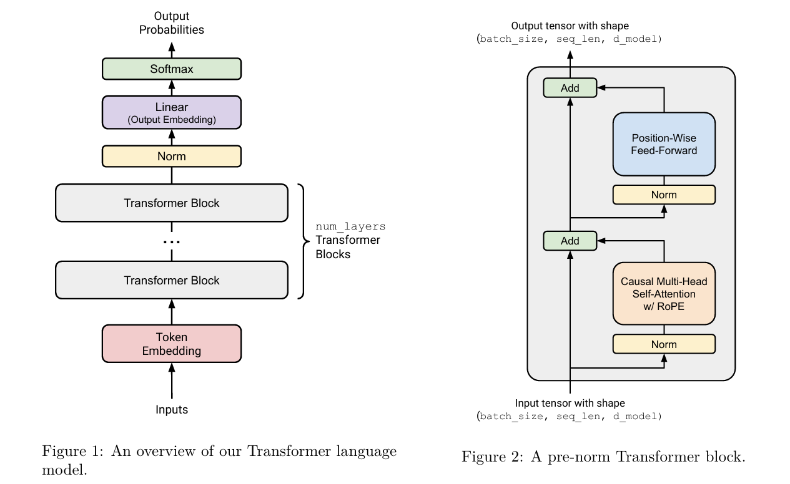

本节依次实现

- 线性层Linear
- 嵌入层Embedding
- 归一化层RMSNorm
- 激活函数SWIGLU（在Position-Wise-Feed-Forward中）
- 旋转位置编码RoPE
- 激活函数softmax
- 多头注意力MHA

- 组装Transformer Block
- 组装Transformer模型

### 思考

本节主要复述一下相关原理和公式，方便手撕的时候背诵，其中rope，MHA等代码实现都是手撕的重点

构思一下数据在transformer中经历了什么

- 输入(batch_size, sequence_length)
- 嵌入(batch_size, sequence_length, d_model)
- pre-norm过程(batch_size, sequence_length, d_model)
- 注意力计算(batch_size, sequence_length, d_model)

### 实现

#### Linear模块

- 输入(...  ,  in_features)
- 权重(out_features ,  in_features)
- 输出(...  ,  out_features)

- 初始化权重

  - 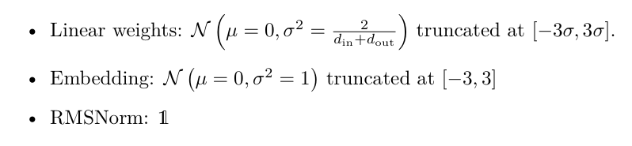

  - ```python
            self.weight = nn.Parameter(torch.empty((out_features,in_features),device=device,dtype=dtype))
            # self.bias = nn.Parameter(torch.empty((out_features,),device=device,dtype=dtype))
            # 使用trunc_normal_初始化权重
            # 原地初始化，避免重绑定导致丢失 Parameter 身份
            mu = 0.0
            std = math.sqrt(2 / (in_features + out_features))
            a = -3 * std
            b = 3 * std
            nn.init.trunc_normal_(self.weight, mean=mu, std=std, a=a, b=b)
    ```

- 实现forward方法，由于输入的最后一维参加运算，所以输入x的形状是(...  ,  in_features)，为了保证这是一个线性变换，所以输出y的形状是(...  ,  out_features)，再根据原文档的要求，实质上实现的是$y=xW^T$，W不允许保存为转置，所以权重的形状是(out_features ,  in_features)

- 使用einsum描述方法

  ```python
  return einsum(
      x,self.weight,
      "... in_features, out_features in_features -> ... out_features"
  )
  ```


#### Embedding模块

- 输入(batch_size,sequence_length)
- 权重(vocab_size,d_model)
- 输出(batch_size,sequence_length,d_model)

- 将seq_len维的每一个id都映射为一个大小为d_model的向量，所以本模块不是矩阵乘法操作，而是访问操作

  - ```python
    def forward(self, token_ids: torch.Tensor) -> torch.Tensor:
        return self.weight[token_ids]
    ```

- 初始化权重

  - ```python
    self.weight = nn.Parameter(torch.empty((num_embeddings,embedding_dim),device=device,dtype=dtype))
    nn.init.trunc_normal_(self.weight, mean=0.0, std=1.0, a=-3.0, b=3.0)
    ```

  - 注意num_embeddings 就是 vocab_size；embedding_dim 就是 d_model


RMSNorm模块

- 原理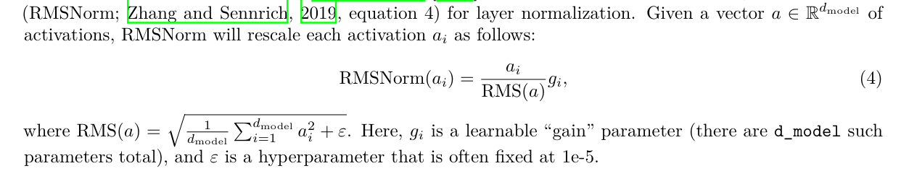

- 注意在这里输入的最后一维需要调整类型为float32，并在最后调整回原本的数据类型，猜测可能是因为会有半精度的数据输入

- 先根据最后一维计算RMS，再依次进行归一化，注意模块存在**一个可学习的参数**，形状是(d_model)，刚好和输入的最后一维一一对应，注意要初始化为全1，不能是全0或者正态分布

- ```python
  def forward(self, x: torch.Tensor) -> torch.Tensor:
      in_dtype = x.dtype
      x = x.to(torch.float32)
  
      rms = self.RMS(x)
      x_norm = x / rms
      result = x_norm * self.weight
      # Return the result in the original dtype
      return result.to(in_dtype)
  
  def RMS(self,x:torch.Tensor)->torch.Tensor:
      assert x.shape[-1] == self.d_model
      return torch.sqrt(x.pow(2).mean(-1,keepdim=True)+self.eps)
  ```


#### SwiGLU

- 是一种SiLU和GLU的结合

- SiLU的原理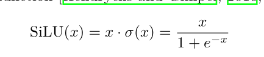

- GLU的原理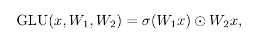

- SwiGLU的原理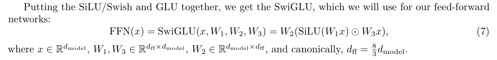

- 注意，上述所有形如$Wx$的矩阵运算，在实现的时候都是$xW^T$

- 事先声明好过程中用到的权重矩阵，在FFN层中的SwiGLU，会声明一个d_ff维度，大小大概是模型维度的8/3，注意三个权重矩阵的形状分别是(d_ff,d_model)、(d_model,d_ff)、(d_ff,d_model)

- **再次强调，为了方便计算机存储，所有一维向量都是行向量，虽然它们在数学上可能是一个列向量；与此同时，权重矩阵仍然存储为实现数学上的运算“$Wx$”中的权重矩阵，也就是说，此时数学上的x的形状是(d_model,1)，故有W的形状是(d_ff,d_model)**

- ```python
  self.w1 = Linear(d_ff,d_model,device=device,dtype=dtype)
   # w1: d_ff, d_model
  self.w2 = Linear(d_model,d_ff,device=device,dtype=dtype)
  # w2: d_model, d_ff
  self.w3 = Linear(d_ff,d_model,device=device,dtype=dtype)
  ```

- 在forward方法中直接按照公式实现即可

- ```python
  wx1 = self.w1(in_feature) # ... d_ff
  silu = wx1 * torch.sigmoid(wx1)
  wx3 = self.w3(in_feature) # ... d_ff
  x2 = silu * wx3 # ... d_ff
  wx2 = self.w2(x2) # ... d_model
  return wx2
  ```


#### RoPE

- 很神奇的一种编码方式，是一种绝对位置编码，但是具有良好的外推性，具有一定的相对位置编码的特性

> 以下笔记将大量参考网络内容

- 如果仅使用qkv相乘的做法，将会使transformer丢失相对于LSTM的一些能力，例如序列的时序性，或者说是不同token之间的相对性，因此需要对向量进行位置编码，将位置信息赋予词向量，从而保证该能力

- 形如$q_m = f_q(x_m,m), k_n = f_k(x_n,n), v_n = f_v(x_n,n)$ 所谓的编码方式就是找到一个合适的$f_q,f_k,f_v$

- $a_{m,n} = \frac{exp(\frac{q_m^T k_n}{\sqrt{d}})}{\Sigma_{j=1}^N (\frac{q_m^T k_n}{\sqrt{d}})} $ 、$o_m = \Sigma_{n=1}^N a_{m,n} v_n$

- 绝对位置编码
  - $f_{q,k,v} (x_i,i) = W{q,k,v}(x_i + p_i)$其中$x_i和p_i$都是一个d维的向量
  - 对于$p_i$向量中每一个位置的元素的计算方法，采用正余弦交替取值
  - $p_{i,2t} = sin(\frac{i}{10000^{\frac{2t}{d}}})$
  - $p_{i,2t+1} = cos(\frac{i}{10000^{\frac{2t}{d}}})$
  - 注意其中10000是一个超参数，其指数均为$\frac{2t}{d}$

- 为了能够利用相对位置信息，提出存在一个函数g有如下性质
  - 内积$<f_q(x_m,m) , f_k(x_n,n) >= g(x_m,x_n,m-n)$
  - 对于二维情况下的向量，有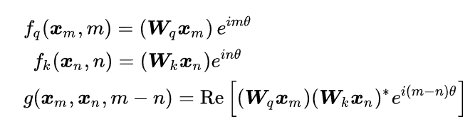
  - 将$e^{im\theta}$展开，就有旋转矩阵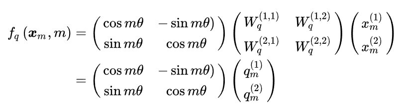
  - 对于旋转矩阵$Ra$，有性质$(Ra)^T = R(-a); Ra Rb = R(a+b)$ 
  - 于是$f_q(x_m,m) = R(m\theta) q_m$
  - 则内积$<f_q , f_k > = (R(m\theta)q_m)^T R(n\theta)k_n = q_m^T R(-m\theta)R(n\theta) k_n = q_m^T R((n-m)\theta)k_n$

- 当扩展到多维情况下时，可以将向量每两个元素一组，仍然可以实现旋转位置编码

- 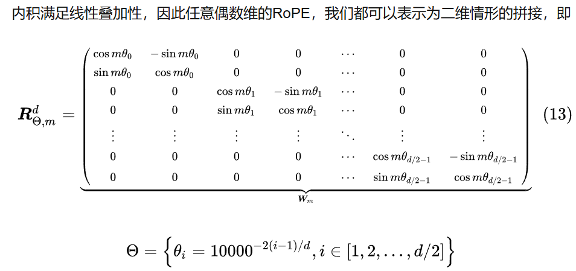

- 此外，由于R矩阵是一个正交矩阵，正交矩阵不会改变向量的模长，因此也通常不会影响模型的稳定性

- 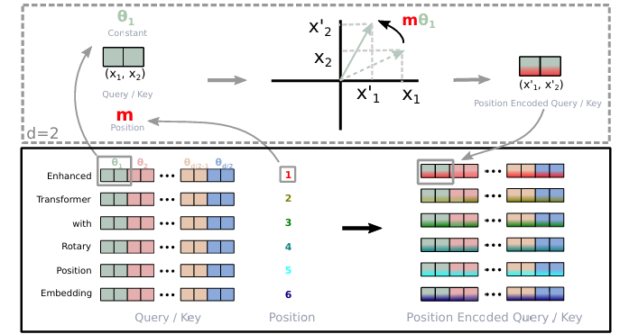

- 代码实现的思路

  - 首先需要预计算R矩阵，注意R矩阵本身就十分稀疏，没必要完整计算d_k * d_k ，另一方面，其实max_seq_len未必就小于d_k，为了良好的外推性，R矩阵最好是max_seq_len * d_k的

  - AI一下

  - > - **R 不是一个整体的 $d_k \times d_k$ 矩阵**
    >
    >   因为：
    >
    >   - 对于每个位置 $p$，整个 $d_k$-维旋转操作是由 **$d_k/2$ 个独立的 2×2 旋转矩阵块**组成；
    >   - 这些 2×2 矩阵是**按维度分块独立作用**的，而不是全维度混合变换；
    >   - 因此，整个旋转矩阵 $R_p$ 实际上是一个 **block-diagonal 矩阵**：
    >
    >   $$
    >   R_p =
    >   \begin{bmatrix}
    >   R_{p,0} & 0 & \cdots & 0 \\
    >   0 & R_{p,1} & \cdots & 0 \\
    >   \vdots & \vdots & \ddots & \vdots \\
    >   0 & 0 & \cdots & R_{p,d_k/2-1}
    >   \end{bmatrix}
    >   $$
    >
    >   其中每个 $R_{p,i}$ 是 2×2。
    >
    >   所以如果你真要展开成一个完整矩阵，它确实是 $d_k \times d_k$，但那是一个非常稀疏的块对角矩阵，没必要显式构造。
    >
    > - **为什么代码里是 `(max_seq_len, d_k)` 的矩阵？**
    >
    >   因为：
    >
    >   1. 对于每个位置 $p$，我们只需要存储对应每个维度的旋转角度（正弦和余弦）；
    >   2. 每两个维度共享同一个角度参数；
    >   3. 因此可以存成两个矩阵：
    >      - `cosine`: `(max_seq_len, d_k/2)`
    >      - `sine`: `(max_seq_len, d_k/2)`
    >
    >   在 forward 时，代码按如下方式对齐：
    >
    >   ```
    >   x_even * cos - x_odd * sin
    >   x_even * sin + x_odd * cos
    >   ```
    >
    >   也就是在每个位置、每对维度上应用旋转。
    >
    > - **为什么不是 `(max_seq_len × max_seq_len)`？**
    >
    >   因为：
    >
    >   - RoPE 不涉及**token-to-token**的交互（不像 self-attention 那样有序列间耦合）；
    >   - 它只对每个 token 的自身向量施加旋转；
    >   - 因此，与位置 $p$ 相关的旋转仅仅依赖于 $p$ 和维度索引 $i$，
    >     而不是两个 token 的位置 $p_1, p_2$；
    >   - 所以我们不需要一个 `max_seq_len × max_seq_len` 的二维关系矩阵。

- 在完成预计算后，需要缓存在类中，方便之后多次使用

- 剩下的步骤就很简单了，根据两个一组的原则，将输入的最后一维按照奇偶分开，依次从偶数组、奇数组各抽出一个（注意，旋转的是词向量各个元素，不能理解为token之间的旋转）

- 将计算结果在最后一维stack，其大小为2，再通过rearrange合并最后一维，这种合并方法会从最后一维的两个元素中依次取数，从而实现结果的奇偶合并

- ```python
  class RoPE(nn.Module):
      def __init__(self, theta: float, d_k: int, max_seq_len: int, device:torch.device |None = None):
          super().__init__()
          assert d_k % 2 == 0, "d_k must be even"
          self.theta = theta
          self.d_k = d_k
  
          self.max_seq_len = max_seq_len
          self.device = device
  
          i = rearrange(torch.arange(max_seq_len),"n -> n 1")
          k = rearrange(torch.arange(d_k//2),"d_kdiv2 -> 1 d_kdiv2")
          angle_rates = 1 / (theta ** (2 * k / d_k)) # (1, d_k/2)
          angle = i * angle_rates # (max_seq_len, d_k/2 )
          self.cosine = torch.cos(angle).to(device) # (max_seq_len, d_k/2 )
          self.sine = torch.sin(angle).to(device) # (max_seq_len, d_k/2 )
          self.register_buffer("cosine_buffer",self.cosine)
          self.register_buffer("sine_buffer",self.sine)
  
      def forward(self, x: torch.Tensor, token_positions: torch.Tensor)-> torch.Tensor:
          token_positions = token_positions.to(torch.int)
          cos = self.cosine_buffer[token_positions] # (batch_size, seq_len, d_k/2)
          sin = self.sine_buffer[token_positions] # (batch_size, seq_len, d_k/2)
          x_even = x[..., ::2] # (batch_size, seq_len, d_k/2)
          x_odd = x[..., 1::2] # (batch_size, seq_len, d_k/2)
          x_rotated_even = x_even * cos - x_odd * sin # (batch_size, seq_len, d_k/2)
          x_rotated_odd = x_even * sin + x_odd * cos # (batch_size, seq_len, d_k/2)
          x_rotated = torch.stack((x_rotated_even, x_rotated_odd), dim=-1) # (batch_size, seq_len, d_k/2, 2)
          x_rotated = rearrange(x_rotated, "... d_kdiv2 two -> ... (d_kdiv2 two)")
          return x_rotated
  ```


#### softmax 

- 其实没什么太多需要注意的，原理如下
- 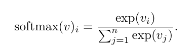
- 注意softmax操作中，所有数加减一个常数不影响结果，因此可以所有数减去最大值，从而提高稳定性

- ```python
  def softmax(x:torch.Tensor,dim:int)->torch.Tensor:
      x_m = torch.max(x,dim=dim,keepdim=True).values
      x_exp = torch.exp(x - x_m)
      x_exp_sum = x_exp.sum(dim=dim,keepdim=True)
      return x_exp / x_exp_sum
  ```


#### MHA

- 实现多头注意力之前，首先要实现scaled_dot_product_attention模块来计算注意力分数
  - 这其实就是我们一般意义上的注意力计算，接受QKV和mask矩阵作为参数
  
  - 公式如下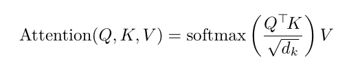
  
  - 当然，仍然要注意，这里公式的描述都是按照数学形式来的，实际存储的是行列交换的，因此计算时需要注意是否转置
  
  - Q的形状是(... , query , d_k)，K的形状是(... , key , d_k)，因此使用的einsum描述是"... queries d_k , ... keys d_k -> ... queries keys"，计算得到注意力分数
  
  - 注意需要使用mask矩阵进行遮盖，通过对注意力分数使用masked_fill方法，根据mask矩阵中标记为False的位置将注意力分数对应全部填补为-inf，即可实现mask功能
  
  - 为什么注意力分数要除以根号d
  
    - 点积的数量级增长很大，因此将 softmax 函数推向了梯度极小的区域
    - 假设q,v各个元素是均值为0，方差为1的正态分布，有两个向量的内积的方差为维度d，则除以$\sqrt{d}$可以使得注意力分数的方差仍然为1
  
  - ```python
    def scaled_dot_product_attention(Q:torch.Tensor,K:torch.Tensor,V:torch.Tensor,mask:torch.Tensor):
        d_k = Q.shape[-1]
        scores = einsum(
            Q , K,
            "... queries d_k , ... keys d_k -> ... queries keys"
        )
        scores = scores / torch.sqrt(torch.tensor(d_k,dtype=scores.dtype))
        for i in range(len(mask.shape)-len(scores.shape)):
            mask = mask.unsqueeze(0)
        # 注意masked_fill_的逻辑和原mask矩阵不同
        # 需要将mask中为False的位置填充为-inf
        scores = scores.masked_fill(mask==False,float("-inf"))
        attn = softmax(scores,dim=-1)
        output = einsum(
            attn,V,
            "... queries keys, ... keys d_v -> ... queries d_v"
        )
        return output
    ```

- 多头注意力实际上就是将最后一个维度分给了多个注意力头来计算，此时每个头维护的维度$d_k = d_{model}//num_{heads}$，其中$d_{model}$就是整个模型词向量的维度，也就是在MHA之前的模块中所说的$d_K$，需要注意区分
- 计算多头注意力的公式如下所示

- 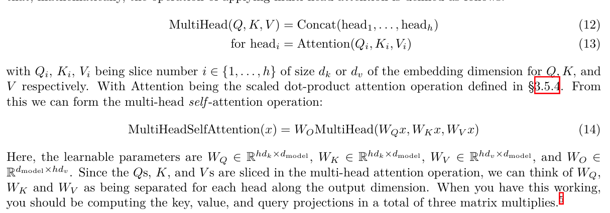

- 在实际实现时，没有必要为每一个头都重新维护QKV的权重矩阵，事实上，这些每个头的权重矩阵本来就应该是同一个权重矩阵
- 因此，可以直接将权重矩阵声明为形状为(d_model, d_model)的方阵，在依次计算每个头的注意力的时候，使用einsum，调整其维度"batch_size seq_len (num_heads d_k) -> batch_size num_heads seq_len d_k"
- 注意需要将num_heads维提到前面，这样才能满足依次计算每个样本 -> 计算每个头 的计算顺序
- 在计算时，注意MHA采用Causal masking，也就是依次遮蔽下一个token，使得模型学习并预测下一个token，在实现时，即生成一个下三角包含主对角线为1的矩阵作为mask矩阵即可
  - 注意mask是相对于token来说的，rope是相对词向量元素来说的；换成好理解的话，就是mask每次遮蔽了当前词向量的下一个词向量，在表现上就是将注意力分数置为-inf，从而使得计算softmax时，该项失去意义（e^(-inf) = 0），而rope是对一个词向量内部的元素，结合该词向量的相对位置进行旋转，从而将位置信息嵌入到词向量中
- 之后对输入的q, k进行rope编码，完成后即可进行注意力的计算，完成计算后使用einsum将多头注意力合并"batch_size num_heads seq_len d_v -> batch_size seq_len (num_heads d_v)"
- 最后结果需要通过输出的权重矩阵，形状是(d_model, d_model)
- 完整代码如下

- ```python
  class MultiheadSelfAttention(nn.Module):
      def __init__(self,
                   d_model:int,
                   num_heads:int,
                   theta:float = None,
                   max_seq_len:int=None,
                   token_positions=None,
                   device:torch.device|None=None,
                   dtype:torch.dtype|None=None):
          super().__init__()
          assert d_model % num_heads == 0, "d_model must be divisible by num_heads"
          self.d_model = d_model
          self.num_heads = num_heads
          self.d_k = d_model // num_heads
          self.d_v = self.d_k
          self.wq = Linear(d_model,d_model,device=device,dtype=dtype)
          self.wk = Linear(d_model,d_model,device=device,dtype=dtype)
          self.wv = Linear(d_model,d_model,device=device,dtype=dtype)
          self.wo = Linear(d_model,d_model,device=device,dtype=dtype)
  
  
          if theta is not None and max_seq_len is not None:
              self.rope = RoPE(theta,d_model//num_heads,max_seq_len,device=device)
              self.token_positions = token_positions
  
  
      def forward(self,Q,K,V):
  
          seq_len = Q.shape[1]
          xq,xk,xv = self.wq(Q),self.wk(K),self.wv(V) # (batch_size, seq_len, d_model)
          xq = rearrange(
              xq,
              "batch_size seq_len (num_heads d_k) -> batch_size num_heads seq_len d_k",
              num_heads = self.num_heads,
              d_k = self.d_k,
          )
          xk = rearrange(
              xk,
              "batch_size seq_len (num_heads d_k) -> batch_size num_heads seq_len d_k",
              num_heads = self.num_heads,
              d_k = self.d_k,
          )
          xv = rearrange(
              xv,
              "batch_size seq_len (num_heads d_k) -> batch_size num_heads seq_len d_k",
              num_heads = self.num_heads,
              d_k = self.d_k,
          )
          # 保留一个下三角为1，其余为0的掩码矩阵，默认包括主对角线
          attention_mask = torch.tril(torch.ones((seq_len,seq_len),dtype=torch.bool,device=Q.device))
          if hasattr(self,"rope"):
              token_positions = self.token_positions
              xq = self.rope(xq,token_positions)
              xk = self.rope(xk,token_positions)
          x = scaled_dot_product_attention(xq,xk,xv,attention_mask) # (batch_size, num_heads, seq_len, d_v)
          x = rearrange(
              x,
              "batch_size num_heads seq_len d_v -> batch_size seq_len (num_heads d_v)"
          ) # (batch_size, seq_len, d_model)
          x = self.wo(x) # (batch_size, seq_len, d_model)
          return x
  ```

#### Transformer Block

- 一个Transformer Block内部有两个norm层，一个因果多头注意力模块，一个FFN模块，每个模块都是pre-norm的，且都使用残差连接
- 原理图如下
- 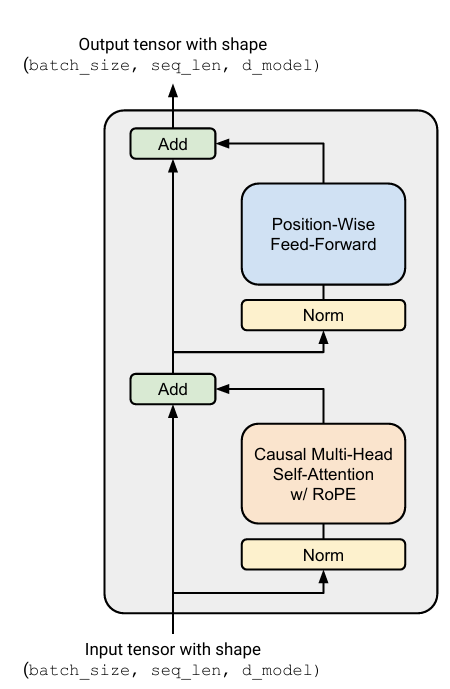
- 按照示意图组装上述模块即可，注意需要手动为MHA模块生成token_positions
- 除此之外，注意使用残差连接，以自注意力这里为例，ADD实际上就是将自注意力输出和输入相加
- 注意：如果你对为什么token_position在这里生成有疑问的话，请参见`adapters.py`中所使用的测试接口，测试的时候会有是否使用rope的区别，如果使用rope，会在外部传入一个positon，这个positon不能保证一定是从零开始的，因此在内部需要暴露一个接口来接受position传入。但是在整个block的层面来看，输入一定是完整的，因此没有必要接受positon，也没有一个模块有资格传入positon来控制训练过程。因此，positon需要在block层面进行初始化，**如果不在这里初始化，说明一定只是在测试功能**

- 

- ```python
  class TransformerBlock(nn.Module):
      def __init__(self,
                   d_model:int,
                   num_heads:int,
                   d_ff:int,
                   max_seq_len:int,
                   theta:float,
                   device:torch.device|None=None,
                   dtype:torch.dtype|None=None
                   ):
          super().__init__()
          self.d_model = d_model
          self.num_heads = num_heads
          self.d_ff = d_ff
          self.max_seq_len =max_seq_len
          self.theta = theta
          self.lm1 = RMSNorm(self.d_model,device=device,dtype=dtype)
          self.lm2 = RMSNorm(self.d_model,device=device,dtype=dtype)
          self.ffn = SwiGLU(self.d_model,self.d_ff,device=device,dtype=dtype)
  
          self.mha = MultiheadSelfAttention(
              self.d_model,
              self.num_heads,
              self.theta,
              self.max_seq_len,
              device=device,
              dtype=dtype
          )
  
          
      def forward(self, x:torch.Tensor):
          # x (batch_size, seq_len, d_model)
          batch_size = x.shape[0]
          seq_len = x.shape[1]
          assert self.d_model == x.shape[2]
  
  
          token_positons = torch.arange(seq_len,device=x.device,dtype=torch.int)
          self.mha.token_positions = token_positons
  
  
          y = x + self.mha(self.lm1(x),self.lm1(x),self.lm1(x))
  
          y_norm = self.lm2(y)
  
          output = y + self.ffn(y_norm)
  
          return output
  ```

#### Transformer 模型

- 组装模型的示意图如下

- 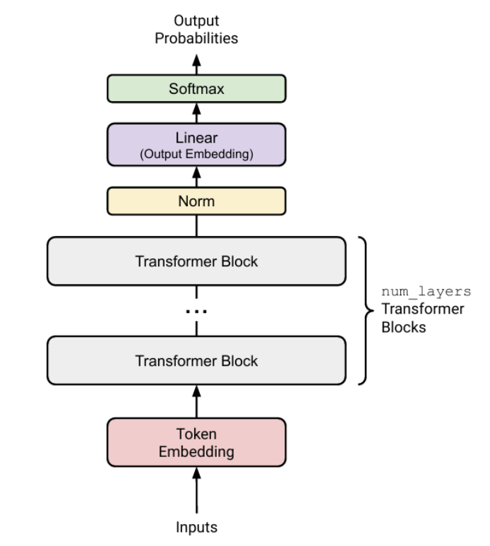

- 仍然是依次组装即可

- 注意最后的结果不需要softmax，非常奇怪

- 复习一下

  - Embedding层(batch_size, seq_len) -> (batch_size, seq_len, d_model)
  - 每个block (batch_size, seq_len, d_model)  -> (batch_size, seq_len, d_model) 
  - Norm层 (batch_size, seq_len, d_model) -> (batch_size, seq_len, d_model) 
  - Linear层，也就是head模块，将结果映射回vocab，实现预测 (batch_size, seq_len, d_model) ->(batch_size, seq_len, vocab_size) 

- ```python
  class TransformerLanguageModel(nn.Module):
      def __init__(self,
                   vocab_size,
                   context_length,
                   d_model,
                   num_layers,
                   num_heads: int,
                   d_ff: int,
                   rope_theta: float,
                   device:torch.device|None=None,
                      dtype:torch.dtype|None=None
                   ):
          super().__init__()
          self.vocab_size = vocab_size
          self.context_length = context_length
          self.num_layers = num_layers
          self.d_model = d_model
          self.num_heads = num_heads
          self.d_ff = d_ff
          self.rope_theta = rope_theta
  
          self.embedding = Embedding(vocab_size,d_model,device=device,dtype=dtype)
          self.transformer_blocks = nn.ModuleList([
              TransformerBlock(
                  d_model,
                  num_heads,
                  d_ff,
                  context_length,
                  rope_theta,
                  device=device,
                  dtype=dtype
              ) for _ in range(num_layers)
          ])
          self.lm = RMSNorm(d_model,device=device,dtype=dtype)
          self.head = Linear(d_model,vocab_size,device=device,dtype=dtype)
  
      def forward(self, token_ids:torch.Tensor)->torch.Tensor:
          x = self.embedding(token_ids) # (batch_size, seq_len, d_model)
          for block in self.transformer_blocks:
              x = block(x) # (batch_size, seq_len, d_model)
          x = self.lm(x) # (batch_size, seq_len, d_model)
          logits = self.head(x) # (batch_size, seq_len, vocab_size)
          # 为什么这里不用softmax？？？？？？
          return logits
  ```

## Train-Loop的实现

### 原理

主要是实现训练过程所需要的三大工具

- 损失函数CrossEntropy
- 优化器AdamW，包括学习率调度和梯度截断
- Train Loop的工具，包括load_data, save_model, load_model等

根据原文档中给出的公式和伪代码实现，注意实现时trick很多，最好使用torch的库函数，否则很有可能导致出现大量NaN错误

**交叉熵公式**

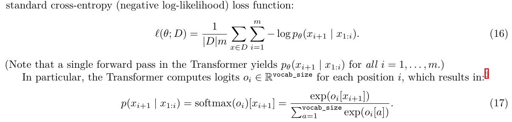

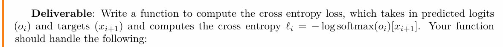

**混淆度公式**

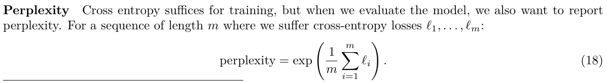

**AdamW优化器伪代码**

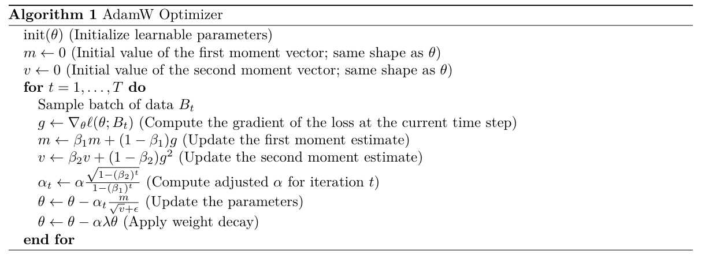

**学习率调度器**

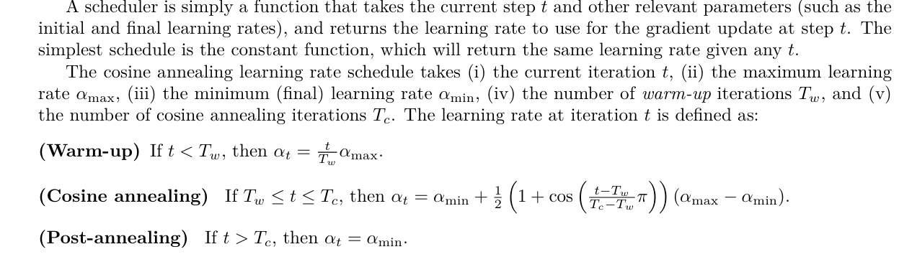

**梯度截断**

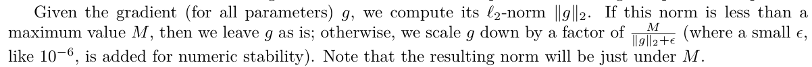

​	注意梯度截断这里不太好理解，以防你忘记了——梯度是一个标量，是所有参数偏导数的和，这里最好结合代码看	

**其他模块**

​	没有很重要的原理

### 思考

交叉熵和AdamW一定是重点，需要能够熟练手撕代码

其他的模块感觉并不是很重要，大概知道是怎么实现的就行

### 实现

#### CrossEntropy

- 注意这个公式，需要知道发生了什么

- 首先对输出序列O的最后一维进行log-softmax运算

- 再按照标签索引进行负对数似然
  - 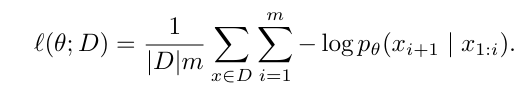


- **以防你不知道这句话在说什么**——targets是标准的“下一个token”，而传入交叉熵函数的是对这个token在vocab范围内的预测，该预测在大小为`vocab_size`的范围内给出属于每一个token的概率，概率之和为1。因此，这里通过标签索引得到了正解的概率的负对数（概率都小于1，求对数之后小于零，取负得到交叉熵），对结果求平均就是交叉熵函数

- logits的形状(batch_size, vocab_size) 

- target的形状(batch_size, ) 

- ```python
  def CrossEntropyLoss(logits: torch.Tensor, targets: torch.Tensor) -> torch.Tensor:
      # 数值稳定：先 log_softmax，再按标签索引负对数似然
      log_probs = logits.log_softmax(dim=-1)
      loss = -log_probs[torch.arange(logits.shape[0]),targets].mean()
      return loss
  ```

#### AdamW

- 中文描述一下AdamW优化器干了什么事

  - 循环外
    - 初始化所有可学习的参数，一般是模块中的权重矩阵
    - 和参数同形状的动量m
    - 和参数同形状的动量n
    - 读入超参数，包括学习率lr，权重衰减率weight_decay，控制动量影响的beta1和beta2，防止分母过小的eps
  - 循环内
    - 先计算所有参数的梯度
    - 根据beta1和梯度更新第一个动量
    - 根据beta2和梯度的平方更新第二个动量
    - 根据beta1，beta2，超参数alpha以及当前训练轮数t更新当前轮数的学习率alpha_t
    - 应用alpha_t，两个动量向量m和v来更新参数（**加入动量后，参数更新就可以保持之前更新趋势，而不会卡在当前梯度较小的点了**）
    - 应用超参数alpha和lambda，对参数进行权重衰减（**权重衰减可以降低模型复杂度**）
    - 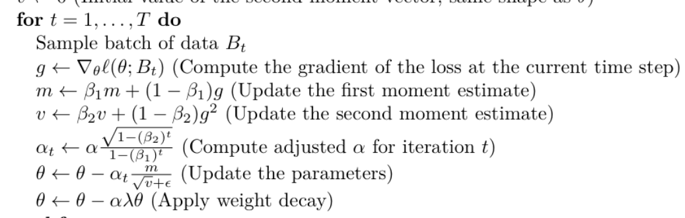

- 为什么能实现这些功能

  - torch中优化器的工作分为三部分：保存需要更新的参数、保存优化超参数、管理每个参数的状态
  - `torch.optim.Optimizer`能够在过程中保存一些参数传递给自己，通过`self.state`来访问这些状态，一般是训练的轮数等数据
  - 除此之外，在初始化时可以通过构造一个字典的方式将参数传入对象中，通过`self.param_groups`访问   

- 在初始化时，外部传入需要优化的参数params和超参数，在init方法中，传入params和defaults从而使得torch能够识别并将其注册为一个优化器

- 为什么要这样配置

  - torch通过这样配置来实现为不同的params捆绑不同的超参数，也就是说，每次init方法传入的params和defaults被作为param_groups的一项，在后续进行优化时也可以通过group访问，例如params就是`group["params"]`，其他的超参数也通过类似的方法访问

- 参数的访问可以通过group来完成，训练过程中的状态则通过`self.state`来保存并更新

  - 同样类似一个字典，用get方法来获取参数，需要设置get默认值，防止初次访问keyError

  - 在优化时，主要是保存当前训练轮数t，两个动量向量m和v，在该轮优化结束时需要将修改过的

- ```  python
  class AdamW(torch.optim.Optimizer):
      def __init__(self,params, lr=1e-3,weight_decay=0.01,betas=(0.9, 0.999),eps=1e-8):
          if lr < 0.0:
              raise ValueError("Invalid learning rate: {}".format(lr))
          if not 0.0 <= betas[0] < 1.0:
              raise ValueError("Invalid beta parameter: {}".format(betas[0]))
          if not 0.0 <= betas[1] < 1.0:
              raise ValueError("Invalid beta parameter: {}".format(betas[1]))
          if not 0.0 <= eps:
              raise ValueError("Invalid epsilon value: {}".format(eps))
          if not 0.0 <= weight_decay:
              raise ValueError("Invalid weight_decay value: {}".format(weight_decay))
          defaults = {
              "lr": lr,
              "betas": betas,
              "eps": eps,
              "weight_decay": weight_decay,
          }
          super().__init__(params, defaults)
  
      def step(self, closure: Optional[Callable] = None):
          loss = None if closure is None else closure()
          for group in self.param_groups:
              lr = group["lr"]
              weight_decay = group["weight_decay"]
              beta1, beta2 = group["betas"]
              eps = group["eps"]
              for p in group["params"]:
                  if p.grad is None:
                      continue
                  state = self.state[p]
                  t = state.get("t",0)
                  t = t + 1
  
                  grad = p.grad.data
                  m = state.get("m",torch.zeros_like(grad))
                  v = state.get("v",torch.zeros_like(grad))
                  m = beta1 * m + (1-beta1) * grad
                  v = beta2 * v + (1-beta2) * (grad**2)
                  at = lr * (math.sqrt(1 - (beta2 ** t))) / (1 - (beta1 ** t))
                  p.data -= at * m / (torch.sqrt(v) + eps)
                  p.data *= (1 - lr * weight_decay)
                  state["t"] = t
                  state["m"] = m
                  state["v"] = v
          return loss
  ```

#### LR Cosine Schedule

- 按照以下描述对学习率进行动态调度，可以在刚开始训练时学习率较大、快速收敛，在快结束时学习率较小，稳定找到最优点

- 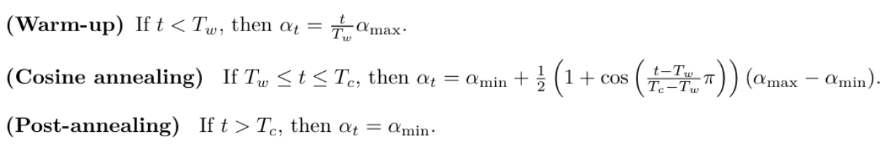

- 其中T_w, T_c, alpha_mim, alpha_max都是外部传入的参数

-  刚开始训练时，在warm-up阶段学习率逐渐到达alpha_max

- 之后进入余弦退火cosine annealing阶段，学习率从alpha_max逐渐退化到alpha_min

- 在退火后post-annealing阶段，学习率固定为alpha_min

- ```python
  def get_lr_cosine_schedule(
      it: int,
      max_learning_rate: float,
      min_learning_rate: float,
      warmup_iters: int,
      cosine_cycle_iters: int,
  ):
      if it < warmup_iters:
          return it/warmup_iters * max_learning_rate
      elif warmup_iters <= it <= cosine_cycle_iters:
          return min_learning_rate + (1 + math.cos((it-warmup_iters)/(cosine_cycle_iters-warmup_iters) * math.pi))*(max_learning_rate-min_learning_rate)/2
      else:
          return min_learning_rate
  ```

#### Gradient Clipping

- 防止梯度爆炸，在RNN和LSTM中很常见

- 通过L2范数的大小来衡量，具体到计算过程中就是所有参数梯度向量的L2范数平方和的平方根，当L2范数超过某个阈值时，等比例缩小所有梯度
- 注意，如果有参数没有梯度，一定要跳过
- 通过`p.grad.data`可以获得一个参数的梯度的tensor，通过`.norm(2)`方法可以计算该张量的L2范数，最后通过`.item()`转换为浮点数
  - 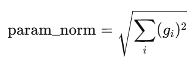
- 最后计算整体的范数，就是所有参数范数的平方和再开平方根
  - 所以公式其实应该长这样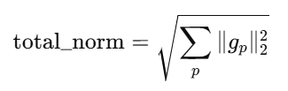

- 最后根据范数是否超出阈值，对所有梯度进行对应的截断

- ```python
  def gradient_clipping(parameters: Iterable[torch.nn.Parameter], max_l2_norm: float):
      total_norm = 0.0
      for p in parameters:
          if p.grad is None:
              continue
          param_norm = p.grad.data.norm(2).item()
          total_norm += math.pow(param_norm,2)
      total_norm = math.sqrt(total_norm)
      coef = max_l2_norm / (total_norm + 1e-6)
      if coef < 1:
          for p in parameters:
              if p.grad is None:
                  continue
              p.grad.data.mul_(coef)
      return parameters
  ```

#### Get Batch

- 首先确定抽样的范围，给出的dataset是一段一维的id序列，batch_size是需要生成的样本的数量，context_length是生成的一条样本的长度

- 由于需要保证所有样本等长，所以能作为样本首个id的下标范围在[0:len(dataset) - context_length) 中**，注意不包含右边界，**提取出这些样本进行随机打乱，抽出其中前batch_size个样本

- ```python
  def get_batch(
      dataset: npt.NDArray, batch_size: int, context_length: int, device: str
  ) -> tuple[torch.Tensor, torch.Tensor]:
      full_lenth = len(dataset)
      indexs = [i for i in range(full_lenth - context_length) ]
      random.shuffle(indexs)
      pre_starts = indexs[:batch_size]
      pre_tokens =[]
      next_tokens=[]
      for i in range(batch_size):
          pre_tokens.append(dataset[pre_starts[i]:pre_starts[i]+context_length])
          next_tokens.append((dataset[pre_starts[i] + 1:pre_starts[i]+context_length +1]))
      pre_tokens_np = np.array(pre_tokens)
      next_tokens_np = np.array(next_tokens)
      return torch.from_numpy(pre_tokens_np).to(device), torch.from_numpy(next_tokens_np).to(device)
  ```

#### Load/Save Checkpoint

- 其实就是保存/读取模型的参数，`state_dict()`方法保存了当前对象中所有可学习参数和缓冲区的状态，收集模型、优化器和当前训练轮数的数据，构造一个字典，并将其通过`torch.save()`方法保存在指定路径中

- 读取时，应用`torch.load()`方法读入一个字典，将对应的项按名索引，并使用`load_state_dict()`方法加载到参数中

- ```python
  def save_checkpoint(
          model:torch.nn.Module,
          optimizer:torch.optim.Optimizer,
          iteration:int,
          out:str|os.PathLike |typing.BinaryIO |typing.IO[bytes]):
      model_dict = model.state_dict()
      optim_dict = optimizer.state_dict()
      d = {
          "model_dict":model_dict,
          "optim_dict":optim_dict,
          "iteration":iteration,
      }
      torch.save(d,out)
  
  def load_checkpoint(
          src:str|os.PathLike |typing.BinaryIO |typing.IO[bytes],
          model:torch.nn.Module,
          optimizer:torch.optim.Optimizer
      ):
      d = torch.load(src)
      model_dict = d["model_dict"]
      optim_dict = d["optim_dict"]
      model.load_state_dict(model_dict)
      optimizer.load_state_dict(optim_dict)
      return d["iteration"]
  ```
